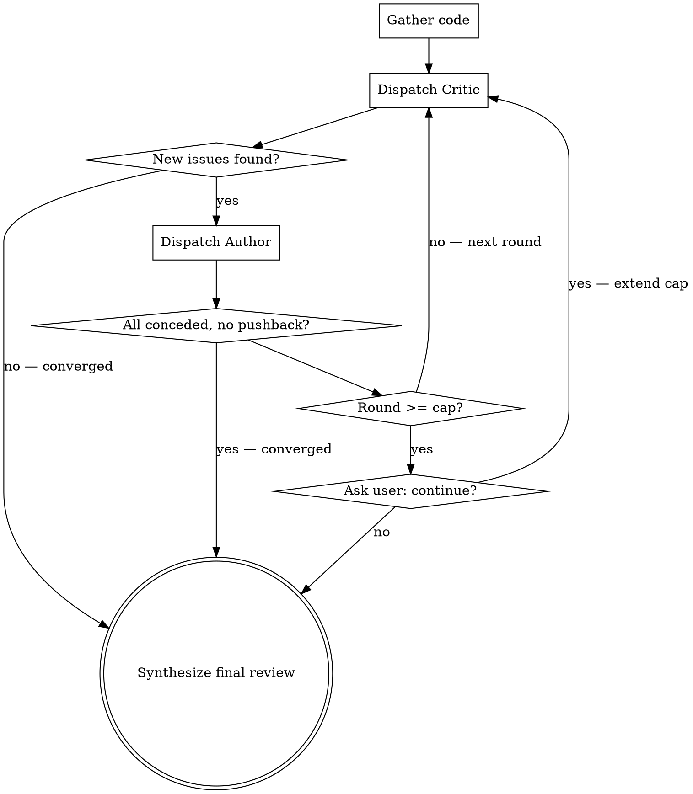

# Adversarial Code Review

Two-agent adversarial code review. The Critic attacks the code with technical
precision; the Author defends it with real reasoning. The back-and-forth
surfaces genuine issues a single-pass review misses.

Both agents ALWAYS run on **opus** with maximum thinking (the dispatch prompt starts with `ultrathink`).

## Invocation

- `/adversarial-review` — review git diff (staged + unstaged), 5 rounds max
- `/adversarial-review 3` — git diff, max 3 rounds
- `/adversarial-review src/auth.ts` — review a specific file/path
- `/adversarial-review src/auth.ts 3` — specific path, 3 rounds max
- Add `nitpicks` anywhere (e.g. `/adversarial-review nitpicks`, `/adversarial-review src/auth.ts 3 nitpicks`) to include minor/nitpick findings in the final report.

## Parse Arguments

1. Strip the `nitpicks` token if present → set `include_nitpicks = true`.
2. No remaining args → target = git diff, cap = 5
3. Number only → target = git diff, cap = that number
4. Path only → target = that path, cap = 5
5. Path + number → target = path, cap = number

**By default `include_nitpicks = false`.** The final report shows only `critical`
and `important` findings. Minor/nitpick findings are dropped unless the user asked for them.

## Orchestration

### Step 1: Gather Code

**If git diff:**
```bash
git diff HEAD
git diff --staged
```
Combine both. If both are empty, tell the user there's nothing to review.

**If file/path:** Read the target file(s). If it's a directory, read all source files in it.

**Always: gather dependency context** so the Critic can scan for vulnerable deps.
Include any of these found in the project root: `package.json`/lockfiles,
`requirements.txt`/`pyproject.toml`, `go.mod`/`go.sum`, `pom.xml`/`build.gradle`,
`Gemfile.lock`, `Cargo.toml`/`Cargo.lock`, `composer.json`/`composer.lock`.

### Step 2: Run the Debate

Initialize: `round = 0`, `debate_history = []`



**Each round:**

1. **Dispatch Critic** via the Agent tool with `model: opus`. Begin the prompt with the literal word `ultrathink` (this maxes the subagent's thinking budget), then include:
   - Full content of `critic-agent.md` from this skill's directory
   - The code under review
   - Full debate history
   - Round number
   - Instruction: "Research only — read the code and produce your review. Do NOT edit any files."

2. **Check convergence:** Parse the Critic's FINDINGS. If all findings repeat previous rounds → converge.

3. **Dispatch Author** via the Agent tool with `model: opus`. Begin the prompt with the literal word `ultrathink`, then include:
   - Full content of `author-agent.md` from this skill's directory
   - The code under review
   - The Critic's latest full response
   - Full debate history
   - Round number
   - Instruction: "Research only — read the code and produce your defense. Do NOT edit any files."

4. **Check convergence:** Parse the Author's FINDINGS. If every point is `[concede]` with no `[defend]`/`[dismiss]` → converge.

5. **Append both responses to debate_history**, increment round.

6. **If round >= cap:** Ask the user *"Continue for more rounds? (y/N)"*. Yes → extend cap by the original amount. No → synthesize.

### Step 3: Synthesize Final Review

Produce a structured summary from the full transcript. **Apply the severity filter:**
include only `critical` and `important` findings unless `include_nitpicks = true`.

```markdown
## Adversarial Review — [target]
### [N] rounds

### Critical (Critic won, Author conceded)
- `file:line` — issue — fix

### Important (Critic won after debate)
- `file:line` — issue — fix

### Contested (Author held ground)
- `file:line` — what was raised — why the defense holds

[Only if include_nitpicks:]
### Nitpicks
- `file:line` — what was raised — impact

### Recommended Changes
- [ ] `file:line` — what to change

If no changes needed: "Nothing actionable. The code holds up."
```
